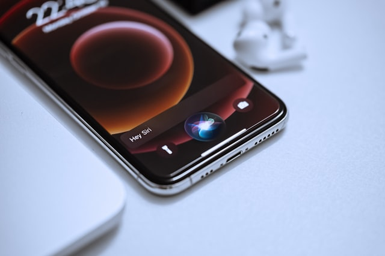

# DNN Speech Recognizer

Photo by <a href="https://unsplash.com/@omidarmin?utm_source=unsplash&utm_medium=referral&utm_content=creditCopyText">Omid Armin</a> on <a href="https://unsplash.com/s/photos/siri?utm_source=unsplash&utm_medium=referral&utm_content=creditCopyText">Unsplash</a>

In this project, I will build a deep neural network that functions as part of an end-to-end automatic speech recognition (ASR) pipeline!
I begin by investigating the LibriSpeech dataset that will be used to train and evaluate my models. my algorithm will first convert any raw audio to feature representations that are commonly used for ASR. I will then move on to building different architectures of  neural network models that can map these audio features to transcribed text.

## Setup
This project requires GPU acceleration to run efficiently.
## contents
1. Data wrangling (Data gathering , Data assessing , Data cleaning).
2. Exploratory Data Analysis.
3. Making some conclusions about the data.
4. developing the models which are :
    1. Model 0: RNN
    2. Model 1: RNN + TimeDistributed Dense
    3. Model 2: CNN + RNN + TimeDistributed Dense
    4. Model 3: Deeper RNN + TimeDistributed Dense
    5. Model 4: Bidirectional RNN + TimeDistributed Dense
    6. Model 5: Custom
    7. model 6: final model
5. visualizing and evaluating the models.

